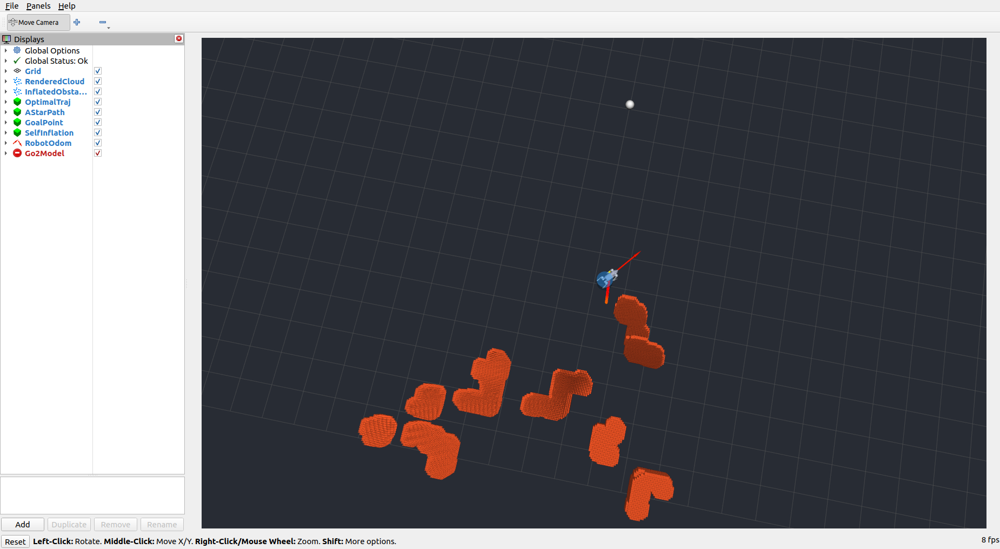

<div align="center">
  <h1>LIVO_Planner_ROS2</h1>
  <h3>A ROS 2 collection of navigation / local planners for LIO · VIO · LIVO SLAM front-ends</h3>
  
  
  
</div>


## 📌 这是什么

**LIVO_Planner_ROS2** 是一个 **ROS 2（Humble）导航 / 局部规划器集合**。把常见的、能与 SLAM 里程计前端（**LIO** 激光惯性 / **VIO** 视觉惯性 / **LIVO** 激光-视觉-惯性）配套使用的 planner 收集到一起，**每个 planner 独立成子项目、可单独编译**，方便按自己的 SLAM 方案与机器人平台挑选、组合、对比。

- 🎯 **一站式**：按 SLAM 前端 / 场景分类，拿来即用
- 🧩 **分开编译**：每个 planner 自带 ROS 2 包与文档，互不依赖，可只编你要的那个
- 🔌 **面向 SLAM 前端**：明确标注每个 planner 设计/验证过的里程计来源

## 🧭 SLAM 前端速览

| 前端 | 全称 | 典型输出 | 代表算法 |
|---|---|---|---|
| **LIO** | LiDAR-Inertial Odometry | 高频位姿 + 稠密点云 | FAST-LIO2、Elevator-LIO、Point-LIO |
| **VIO** | Visual-Inertial Odometry | 位姿 + 稀疏特征/深度 | VINS-Fusion、OKVIS |
| **LIVO** | LiDAR-Inertial-Visual Odometry | 位姿 + 稠密带色点云 | FAST-LIVO2、R3LIVE |

## 📚 收录目录（Catalog）

| Planner | 场景 / SLAM 前端 | 机器人 | 状态 | 目录 | 论文 / 来源 |
|---|---|---|---|---|---|
| **SCAN-Planner** | 3D 局部避障 · **LIO** | 四足 Unitree Go2 | ✅ 可用 | [`src/SCAN-Planner/`](src/SCAN-Planner/) | Zheng et al. 2026, [arXiv:2606.19555](https://arxiv.org/abs/2606.19555) |
| **Ego-Planner-2D-ROS2** | 2D 平面规划 · 通用栅格 / 2D LiDAR | 地面机器人 AGV/AMR | ✅ 可用 | [`src/Ego-Planner-2D-ROS2/`](src/Ego-Planner-2D-ROS2/) | Zhou et al. 2020 (EGO-Planner), [arXiv:2008.08835](https://arxiv.org/abs/2008.08835) |
| _（待收录）_ | VIO / LIVO | — | 🚧 计划中 | — | — |

## 🗂️ 仓库结构（分开编译）

```
LIVO_Planner_ROS2/              # colcon 工作区根
├── README.md                   # 本文件（集合门面）
├── docs/                       # SCAN-Planner 的文档（编译/运行/迁移/截图）
└── src/
    ├── SCAN-Planner/           # Planner #1（LIO，四足）— 13 个 ROS 2 包
    └── Ego-Planner-2D-ROS2/    # Planner #2（2D，地面机器人）— ego_planner 包
```

每个 planner = `src/` 下一个自成一体的子目录，拥有各自的 ROS 2 包、README、依赖与 launch，不跨 planner 依赖 → 可单独编译。

**按需编译：**
```bash
cd /home/ros/rosws/planner_ws && source /opt/ros/humble/setup.bash
colcon build                                   # 全部
colcon build --packages-up-to scan_planner     # 只编 SCAN-Planner 核心
colcon build --packages-select ego_planner     # 只编 Ego-Planner-2D
# 完全隔离某个 planner：在其目录放空文件 COLCON_IGNORE
```

---

## 1️⃣ SCAN-Planner — 四足局部规划器（LIO）

<p align="center"></p>

**空间碰撞感知局部规划器**，面向四足机器人（适配 Unitree Go2）。把 LIO 前端的配准点云转成**机器人中心滑动占用地图**，前端动态 A* 搜索 + 后端 B 样条优化实时生成安全避障轨迹，为自主探索、视觉语言导航等上层任务提供底层运动规划。含 **MARSIM 迷宫仿真**，无需真机即可复现。已从原 ROS 1 完整迁移到 **ROS 2 Humble**（13 个 ament_cmake 包）。

- **适配前端**：LIO（[FAST-LIO2](https://github.com/hku-mars/FAST_LIO) / [Elevator-LIO](https://github.com/xiaofan4122/Elevator-LIO)），真机模式消费 `/LIO/odom_vehicle`、`/LIO/clouds_lidar`
- **编译 & 运行**：
  ```bash
  colcon build --packages-up-to scan_planner   # 核心；含仿真用 colcon build
  source install/setup.bash
  ros2 launch scan_planner run.launch.py        # 仿真 + 规划器 + RViz2 一键启动
  # 发目标：RViz “2D Goal Pose”，或 ros2 topic pub /move_base_simple/goal ...
  ```
- **文档**：[编译](docs/scan_planner_compiled.md) · [运行/排查](docs/example.md) · [ROS1→ROS2 迁移](docs/ros2_migration_guide.md)
- **论文**：
  ```bibtex
  @article{zheng2026scan,
    title={SCAN-Planner: Spatial Collision-Aware Local Planning for Route-Guided Long-Range Quadruped Navigation},
    author={Zheng, Han and Chen, Zhe and Fu, Yiwen and Yang, Ming and Qin, Tong},
    journal={arXiv preprint arXiv:2606.19555}, year={2026}
  }
  ```
- **来源 / 许可**：[wuyi2121/SCAN-Planner](https://github.com/wuyi2121/SCAN-Planner) · Apache-2.0（[LICENSE](src/SCAN-Planner/LICENSE)）

---

## 2️⃣ Ego-Planner-2D-ROS2 — 地面机器人 2D 轨迹优化

面向地面移动机器人（AGV/AMR）的**真 2D 轨迹优化**方案，基于 ZJU-FAST-Lab 的 EGO-Planner 做**降维重构**：优化变量从 3 维降到 2 维（仅 $x,y$），环境层重构为 **2D 栅格地图**，A* 前端降维到平面搜索，核心为纯 C++、ROS 2 外壳封装，支持 RViz2 交互式仿真开箱即用。

- **适配前端**：通用 2D 栅格 / 2D LiDAR（可由 2D LiDAR SLAM 或 LIO 投影得到的占用栅格驱动）；RViz 交互障碍物
- **编译 & 运行**：
  ```bash
  colcon build --packages-select ego_planner
  source install/setup.bash
  ros2 run ego_planner motion_plan
  rviz2   # 2D Pose Estimate 设起点，2D Nav Goal 设目标，Publish Point 加障碍
          # 话题 /visual_local_obstacles 查看膨胀障碍
  ```
- **论文（原始 EGO-Planner）**：
  ```bibtex
  @article{zhou2020ego,
    title={EGO-Planner: An ESDF-free Gradient-based Local Planner for Quadrotors},
    author={Zhou, Xin and Wang, Zhepei and Ye, Hongkai and Xu, Chao and Gao, Fei},
    journal={IEEE Robotics and Automation Letters}, volume={6}, number={2},
    pages={478--485}, year={2020}, publisher={IEEE}
  }
  ```
- **来源 / 许可**：[JackJu-HIT/Ego-Planner-2D-ROS2](https://github.com/JackJu-HIT/Ego-Planner-2D-ROS2)（MIT）· 原项目 [ZJU-FAST-Lab/ego-planner](https://github.com/ZJU-FAST-Lab/ego-planner)（[arXiv:2008.08835](https://arxiv.org/abs/2008.08835)）

---

## ➕ 如何加入一个新 Planner

1. 在 `src/<PlannerName>/` 下放该 planner（**ROS 2 / ament_cmake**，自带 `package.xml` + `CMakeLists.txt`）。
2. **保持独立**：不依赖其它 planner 的包；有一个明确的"主包"以便 `--packages-up-to` / `--packages-select`。
3. 目录内附 `README`，说明：适配的 SLAM 前端、订阅/发布话题、编译与运行步骤。
4. 在上方 **收录目录** 与本节增加对应条目，并**带上论文引用**。
5. 保留原作者的许可与归属。

## 🔗 SLAM 前端参考

- **LIO**：[FAST-LIO2](https://github.com/hku-mars/FAST_LIO) · [Elevator-LIO](https://github.com/xiaofan4122/Elevator-LIO) · [Point-LIO](https://github.com/hku-mars/Point-LIO)
- **VIO**：[VINS-Fusion](https://github.com/HKUST-Aerial-Robotics/VINS-Fusion)
- **LIVO**：[FAST-LIVO2](https://github.com/hku-mars/FAST-LIVO2) · [R3LIVE](https://github.com/hku-mars/r3live)

## ⚖️ 许可与归属

本仓库是一个**集合**，各 planner 的著作权、许可与论文引用**归其原作者所有**：
- **SCAN-Planner** — Apache-2.0，Zheng et al. 2026（arXiv:2606.19555）
- **Ego-Planner-2D-ROS2** — MIT，二次开发自 EGO-Planner（Zhou et al. 2020, arXiv:2008.08835）
